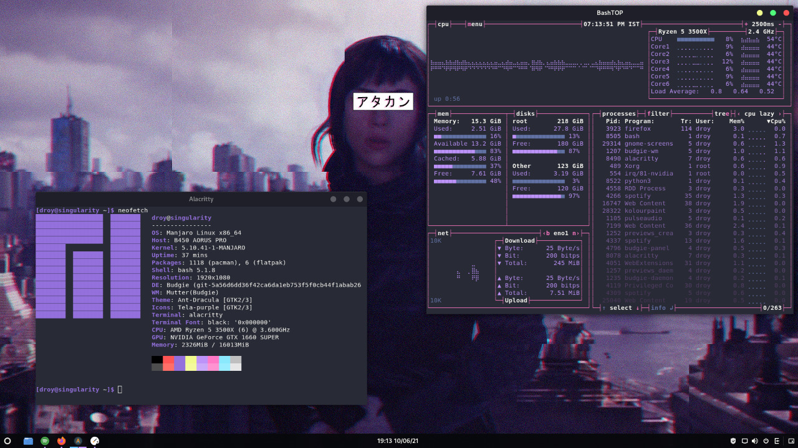

# Budgie
Budgie是一款基于GNOME技术的现代桌面环境，它是由Solus项目的开发人员开发的，现已成为独立的项目。Budgie环境提供了一个简洁、现代和易于使用的用户界面，具有许多定制化选项和功能。

Budgie桌面环境的主要特点包括：

简洁、现代的用户界面设计；
可定制化的面板和菜单；
集成了Raven面板，提供了快速访问设置、通知、音量调节等功能；
支持GNOME应用程序和插件；
提供了许多主题和外观选项。
Budgie环境可以在多个Linux发行版中使用，包括Solus、Arch Linux、Ubuntu Budgie等，也可以作为独立的桌面环境使用。它是一款轻量级的桌面环境，使用起来非常流畅，适合新手和有经验的Linux用户使用。

## 截图



## 安装方法
```bash
sudo pacman -Syu #更新系统
sudo pacman -S budgie #安装Budgie
# 确保自己有一个显示管理器 GDM、SDDM、LightDM 
```

## 相关网址

| 官方网站                   | https://getsol.us/home/                         |
| -------------------------- | ----------------------------------------------- |
| Budgie桌面环境的GitHub仓库 | https://github.com/solus-project/budgie-desktop |
| Budgie社区论坛             | https://discourse.ubuntubudgie.org/             |
| Budgie社区Wiki             | https://wiki.archlinux.org/title/Budgie         |

