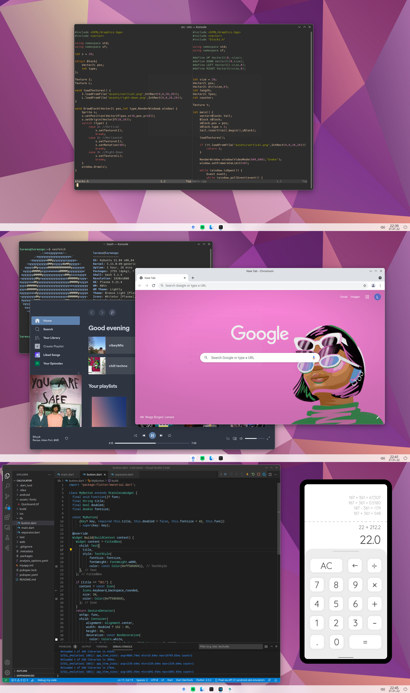

# Cutefish

Cutefish是一款基于Qt技术的现代桌面环境，由中国开发人员开发。它提供了一个简洁、现代和易于使用的用户界面，同时也具有高度的可定制化选项和丰富的功能。

Cutefish桌面环境的主要特点包括：

- 简洁、现代的用户界面设计，采用扁平化和半透明的元素；
- 提供了一个灵活的面板和菜单，可定制化布局、样式和插件；
- 支持Qt应用程序和插件，同时也支持自己的Cutefish扩展和应用程序；
- 提供了许多主题和外观选项，可以轻松地改变桌面环境的外观；
- 具有一些实用的功能，如窗口管理、工作区管理、通知中心等。

Cutefish环境目前还处于开发阶段，但已经可以在多个Linux发行版中使用，包括Manjaro、Arch Linux等。它是一款流畅、稳定、易用的桌面环境，适合新手和有经验的Linux用户使用。

## 截图



## 安装方法

```bash
sudo pacman -Syy
sudo pacman -S cutefish
```

## 相关网址

| 官方网站                     | https://cutefishos.com/        |
| ---------------------------- | ------------------------------ |
| Cutefish桌面环境的GitHub仓库 | https://github.com/cutefishos/ |

