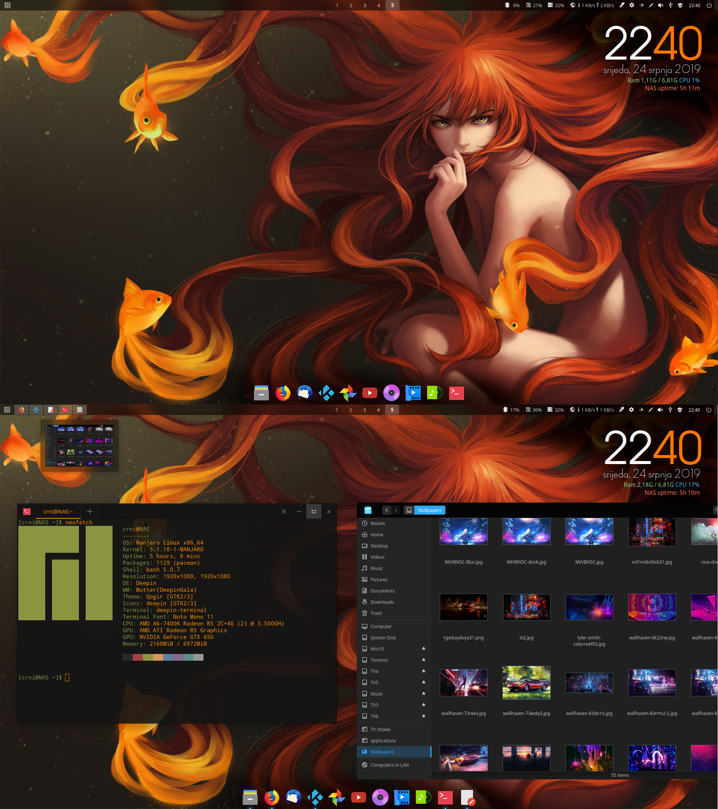

# Deepin

Deepin是一款基于Linux的操作系统，由中国深度科技公司开发。Deepin提供了一个美观、易用、流畅的桌面环境，同时也具有高度的定制化选项和丰富的功能。

Deepin桌面环境的主要特点包括：

- 简洁、现代的用户界面设计，采用扁平化和半透明的元素；
- 提供了一个灵活的面板和菜单，可定制化布局、样式和插件；
- 支持GNOME应用程序和插件，同时也支持自己的Deepin扩展和应用程序；
- 提供了许多主题和外观选项，可以轻松地改变桌面环境的外观；
- 具有一些实用的功能，如窗口预览、窗口管理、工作区管理等；
- 拥有Deepin Store应用商店，可供用户浏览和下载软件。

Deepin环境可以在多个Linux发行版中使用，包括Deepin自己的发行版、Ubuntu等。它是一款流畅、稳定、易用的桌面环境，适合新手和有经验的Linux用户使用。

在Deepin上预装有许多软件，例如WPS Office、Deepin Movie、Deepin Music、Deepin Screenshot等。同时，Deepin还提供了一些专有的软件，例如Deepin Clone、Deepin Repair等，这些软件可以帮助用户备份和恢复系统、修复系统问题等。

## 截图



## 安装方法

```bash
sudo pacman -Syy
sudo pacman -S deepin deepin-extra
```


## 相关网址

| 官方网站                     | https://www.deepin.org/                  |
| ---------------------------- | ---------------------------------------- |
| Deepin桌面环境的GitHub仓库   | https://github.com/linuxdeepin/          |
| Deepin社区论坛               | https://bbs.deepin.org/                  |
| Deepin Store应用商店         | https://appstore.deepin.com/             |
| Deepin的Arch Linux软件包信息 | https://archlinux.org/packages/?q=deepin |

