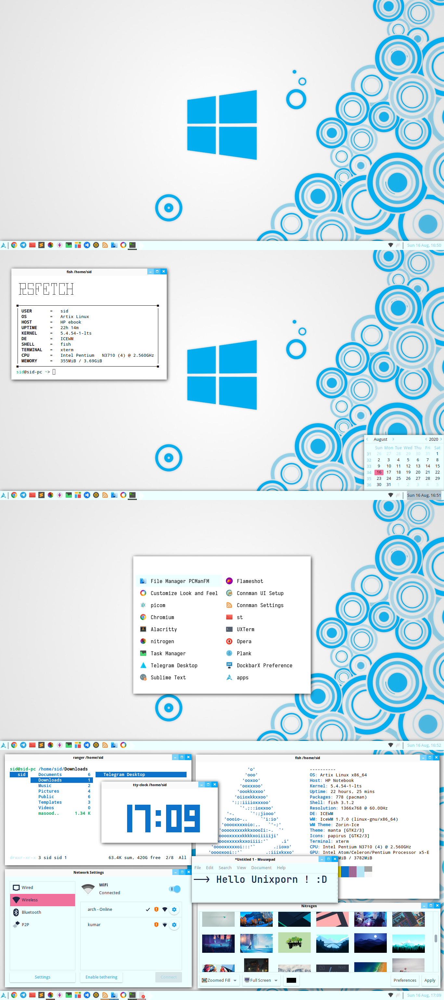

# IceWM

IceWM 是一个轻量级的窗口管理器,设计简单且令人愉悦。它具有以下一些主要特性:

• 轻量级、快速 - 内存占用少,对系统资源的需求低。

• 简单且易于使用 - 提供简单的界面和键盘快捷键,易于上手。

• 高度可定制 - 支持加载主题和配置选项,可以根据个人喜好进行大幅定制。

• 基于菜单的界面 - 提供基于菜单的应用程序启动器和桌面右键菜单。

• 键盘友好 - 提供统一的键盘快捷键,可以高效地进行窗口管理。

• 支持多桌面 - 提供虚拟桌面以扩展屏幕空间。

• 本地化 - 支持多语言,可根据系统语言提供界面本地化

## 截图



## 安装方法

```bash
sudo pacman -S icewm
```

后你可以在 LightDM 等登录管理器中选择 IceWM 会话登录,或在终端运行 `icewm-session` 启动 IceWM。

IceWM 的配置文件位于 `~/.icewm` 目录下,包括:

- `toolbar` - 设置工具栏
- `menu` - 设置应用程序菜单
- `preferences` - 一般设置如样式、壁纸等
- `keys` - 设置键盘快捷键
- `startup` - 设置启动时运行的程序

## 相关网址

| IceWM 官方网站   | http://www.icewm.org/                    |
| ---------------- | ---------------------------------------- |
| IceWM 主题和插件 | https://www.box-look.org/browse/cat/146/ |
| IceWM 论坛       | http://www.icewm.org/forums/             |
| IceWM Wiki       | https://wiki.archlinux.org/title/IceWM   |

