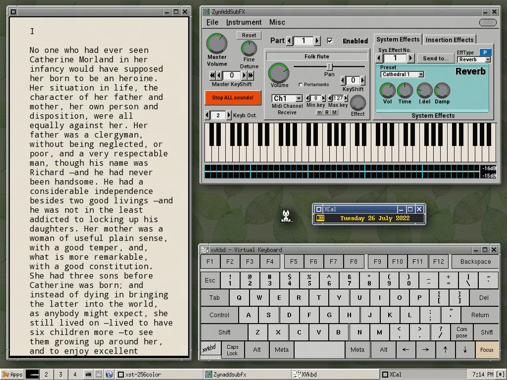

# JWM

JWM（Joe's Window Manager）是一个轻量级的窗口管理器，它被设计用于在低端硬件上运行。它的特点是速度快、资源消耗少，并且易于定制

## 截图



## 安装方法

```bash
sudo pacman -Syu
sudo pacman -S jwm
```


## 相关网址

| JWM官方网站                 | http://joewing.net/projects/jwm/                         |
| --------------------------- | -------------------------------------------------------- |
| JWM在Arch Linux的软件包页面 | https://www.archlinux.org/packages/community/x86_64/jwm/ |
| JWM在GitHub上的源代码仓库   | https://github.com/joewing/jwm                           |
| JWM用户手册                 | http://joewing.net/projects/jwm/man.shtml                |
| ArchWiki上的JWM页面         | https://wiki.archlinux.org/title/JWM                     |

