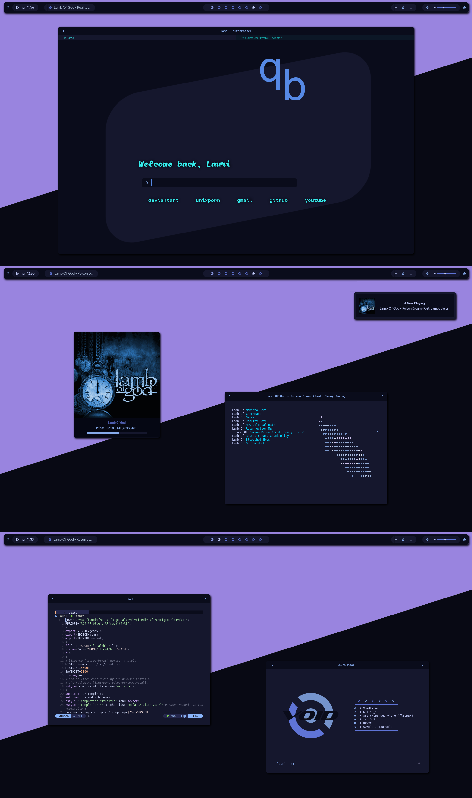

# Openbox

Openbox是一个轻量级、高度可配置的窗口管理器，适用于X Window System，在Linux和其他类Unix操作系统上广泛使用。它的设计理念是极简和高速，提供了一种简单高效的方式来管理窗口和桌面环境。Openbox可以通过配置文件高度自定义，并可通过第三方插件和脚本扩展功能。通常与其他桌面环境或面板（如LXDE）一起使用，这样可以提供更完整的桌面环境，同时仍然使用Openbox作为窗口管理器

## 截图



## 安装方法

```bash
sudo pacman -Syu
sudo pacman -S openbox 
```


## 相关网址

| Openbox官方网站       | http://openbox.org/wiki/Main_Page        |
| --------------------- | ---------------------------------------- |
| Openbox Arch Wiki页面 | https://wiki.archlinux.org/title/Openbox |

