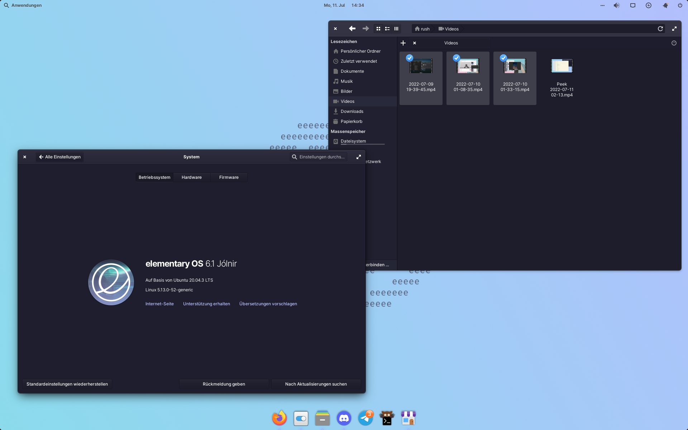

# Pantheon

Pantheon桌面环境，是由elementary OS团队开发的一款基于GNOME技术的桌面环境，旨在提供一个简洁、美观和易于使用的用户界面。

Pantheon桌面环境的主要特点包括：

- 精美的设计和高质量的图标、字体和主题；
- 快速的应用程序启动和切换；
- 轻松的应用程序管理和安装；
- 无缝的集成了elementary OS的核心应用程序；
- 支持动态工作区和多个显示器；
- 提供了一些独特的功能，如应用程序行为、会话控制等。

## 截图

