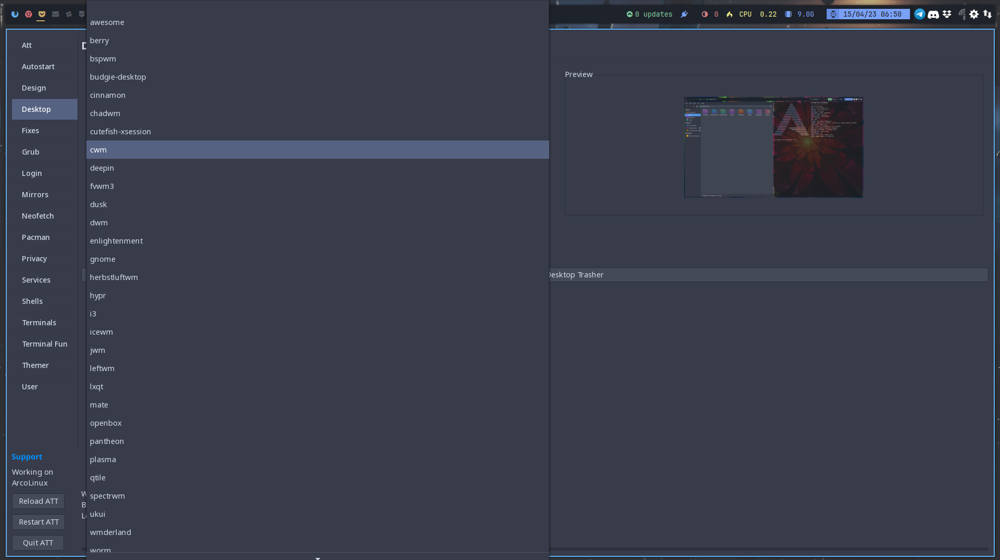

# Desktop 与 Twm

Linux 桌面环境是基于 Linux 操作系统的图形用户界面。与 Windows 和 Mac OS X 等商业操作系统不同，Linux 提供了多种桌面环境供用户选择，以满足不同用户的需求和喜好。本文将介绍一些常见的 Linux 桌面环境，包括 GNOME、KDE、XFCE、LXDE 等，并提供安装和配置的指导，以及一些美化和优化的技巧。

- [GNOME](./desk/gnome.md)： GNOME 是最受欢迎的 Linux 桌面环境之一，提供现代化的用户界面和丰富的功能。它的外观简洁、现代，适合那些注重视觉美感的用户。安装 GNOME 可以使用各个主流发行版的包管理器，如 apt-get、dnf、pacman 等。在安装完成后，您可以使用 GNOME Tweak Tool 对其进行优化和美化。

- [KDE](./desk/kde)：KDE 是 Linux 中最受欢迎的桌面环境之一，提供了丰富的功能和可自定义的外观。它是一个高度可配置的桌面环境，可以适应各种使用情况。安装 KDE 可以使用各个主流发行版的包管理器，如 apt-get、dnf、pacman 等。在安装完成后，您可以使用 KDE System Settings 对其进行优化和美化。

- [XFCE](./desk/xfce)：XFCE 是一款轻量级的桌面环境，占用系统资源很少，适合那些使用低端硬件的用户。它提供了简洁的用户界面和基本的功能。安装 XFCE 可以使用各个主流发行版的包管理器，如 apt-get、dnf、pacman 等。在安装完成后，您可以使用 Xfce Settings Manager 对其进行优化和美化。

- [LXDE](./desk/lxqt)：LXDE 是另一款轻量级的桌面环境，占用系统资源最少，适合那些使用低端硬件的用户。它提供了简洁的用户界面和基本的功能。安装 LXDE 可以使用各个主流发行版的包管理器，如 apt-get、dnf、pacman 等。在安装完成后，您可以使用 LXAppearance、Openbox Configuration Manager 等工具对其进行优化和美化。

无论您是新手还是经验丰富的 Linux 用户，本文都将为您提供有用的信息和指导，以帮助您更好地使用和管理 Linux Desktop。


```bash
#所有的桌面都可以使用Archlinux-tweak-tool-git工具安装
## 此处只介绍安装方法，不详细介绍配置方法。建议使用ATT省时省力，而且已经配置好了
yay -S archlinux-tweak-tool-git
```


